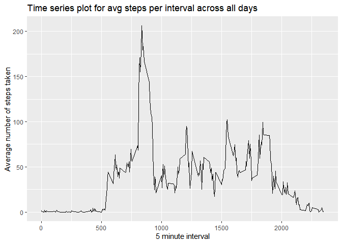
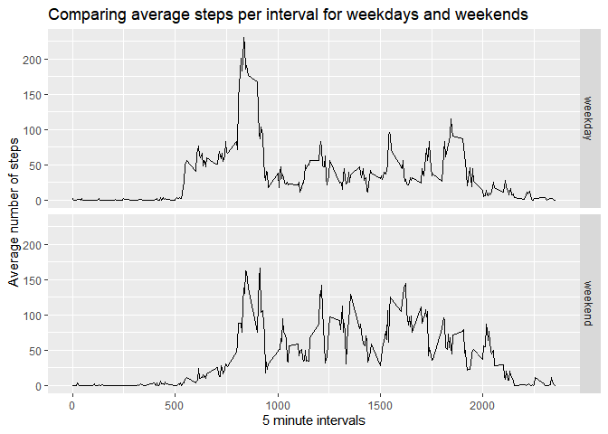

# Course Project 1

### Loading and preprocessing the data
The file activity.zip contains data from a personal activity device spanning a time period of 2 months.
Before analysis, the data needs to be read from the csv file into a data frame, repdata. Once that is done, the data needs to be transformed into a format suitable for analysis.


```r
#unzip to folder if not already done
if(!file.exists("activity.csv"))
{
  unzip("activity.zip")
}
#Read and format data
repdata<-read.csv("activity.csv",stringsAsFactors = FALSE)
repdata$date<-as.Date(repdata$date)
```

### Calculating mean number of steps taken per day

For this part of the calculation, we can ignore the missing values from our data. Sum of number of steps is calculated for each day.


```r
#get sum of number of steps for each day, omitting the missing values
totalsteps<-tapply(repdata$steps, repdata$date, sum,na.rm=TRUE)
```

Make a histogram for the total number of steps each day


```r
#plot a histogram for total steps taken each day

hist(totalsteps,xlab = "Total steps taken each day",
     main = "Histogram of total steps taken each day")
```

<!-- -->

Calculating mean and median of total steps taken each day


```r
meansteps<-round(mean(totalsteps))
mediansteps<-median(totalsteps)
```


```
## [1] "Mean:  9354"
```

```
## [1] "Median:  10395"
```

### Finding the daily activity pattern

Calulating the average steps taken for each interval across all days


```r
library(dplyr)
avg_steps_intvl<-aggregate(steps~interval,data = repdata,FUN = mean,
                           na.rm=TRUE)
```

Plotting the time-series graph for average steps taken per interval across all days


```r
library(ggplot2)

ggplot(data = avg_steps_intvl,aes(x=interval,y=steps))+geom_line()+xlab("5 minute interval")+ylab("Average number of steps taken")+ggtitle("Time series plot for avg steps per interval across all days")
```

<!-- -->

Finding the time interval which has maximum average number of steps across all days


```r
max_avg_steps<-avg_steps_intvl[which.max(avg_steps_intvl$steps),][[1]]
print(paste("Interval with max avg steps: ",max_avg_steps))
```

```
## [1] "Interval with max avg steps:  835"
```

### Imputing missing values

Calculating total number of missing values in the data


```r
missing_total<-sum(is.na(repdata))
print(paste("Total missing values: ",missing_total))
```

```
## [1] "Total missing values:  2304"
```

Imputing missing data and creating a new dataframe with no missing values.
This is done by replacing each missing value by the average of steps for that interval across all days.


```r
repdata_full<-repdata
for (i in 1:nrow(repdata_full)) {
    if(is.na(repdata_full$steps[i])) {
        val <- avg_steps_intvl$steps[which(avg_steps_intvl$interval == repdata_full$interval[i])]
        repdata_full$steps[i] <- val 
    }
}
```

Make a histogram for the total number of steps each day


```r
#get sum of number of steps for each day
totalsteps_full<-tapply(repdata_full$steps, repdata_full$date, sum)

#plot a histogram for total steps taken each day

hist(totalsteps_full,xlab = "Total steps taken each day",
     main = "Histogram of total steps taken each day")
```

<!-- -->

Calculating mean and median of total steps taken each day after imputing


```r
meansteps_full<-round(mean(totalsteps_full))
mediansteps_full<-round(median(totalsteps_full))
```


```
## [1] "Mean:  10766"
```

```
## [1] "Median:  10766"
```

We note that the mean and median steps HAVE CHANGED after imputing the data.

The mean and median of steps have both increased after imputing.

### Finding differnces in activity patterns in weekdays and weekends

Adding a factor variable to the data, indicating whether it is a weekday or weekend


```r
repdata_full$day<-ifelse(weekdays(as.Date(repdata_full$date))=="Saturday" | weekdays(as.Date(repdata_full$date))=="Sunday","weekend","weekday")

repdata_full$day<-factor(repdata_full$day)
```

Making a time-series panel plot for average steps per interval acrosss all days for weekdays and weekends


```r
avg_steps_intvl_day<-aggregate(steps~interval+day,data = repdata_full,FUN = mean)

ggplot(data = avg_steps_intvl_day,aes(interval,steps))+geom_line()+facet_grid(day~.)+xlab("5 minute intervals")+ylab("Average number of steps")+ggtitle("Comparing average steps per interval for weekdays and weekends")
```

<!-- -->
